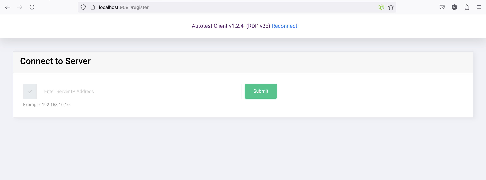
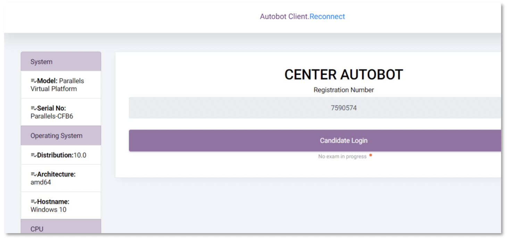

# Running the App

## Overview

This document provides instructions for running the Autobot Candidate Application, including how to connect to the Admin server.

## Accessing the Application

1. **Start the Application**:
   Ensure that your application is running. If you're using Maven, you can start the application with the following command:

   ```bash
   mvn spring-boot:run
   ```

2. **Open Your Web Browser**:
   Once the application is running, open a web browser of your choice.

3. **Navigate to the Application**:
   Type the following URL in the address bar:

   - **Local Access**: 
     ```plaintext
     http://localhost:9091
     ```
   - **Remote Access**: 
     Replace `<ip-address>` with the actual IP address of the machine running the application:
     ```plaintext
     http://<ip-address>:9091
     ```

   

## Connecting to the Admin Server

1. **Enter the Admin Server's IP Address**:
   Once the application interface is up, the user will be prompted to enter the server's IP address. This is required to establish a connection with the Admin server.

2. **Connect**:
   After typing in the server's IP address, click on the "Connect" button to establish a connection to the Admin server.

   
