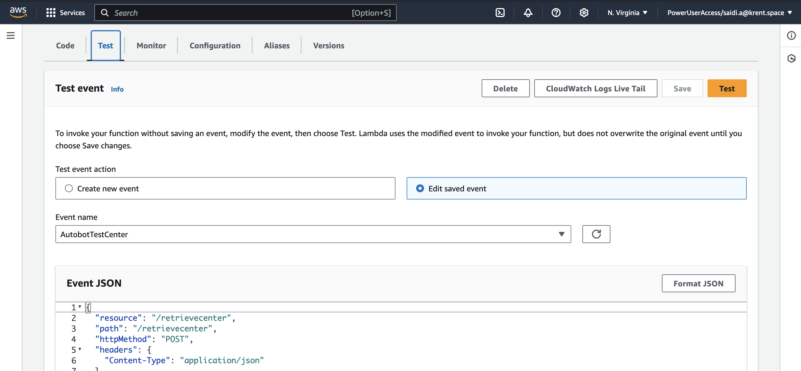
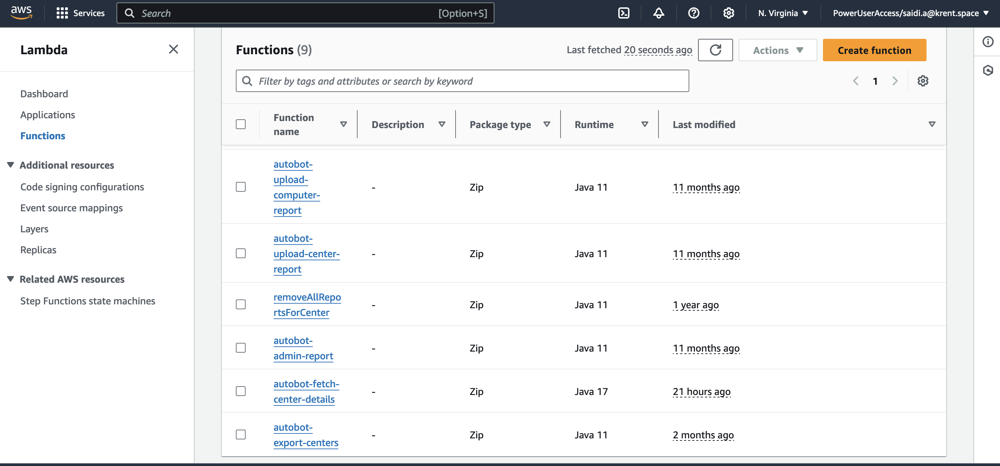
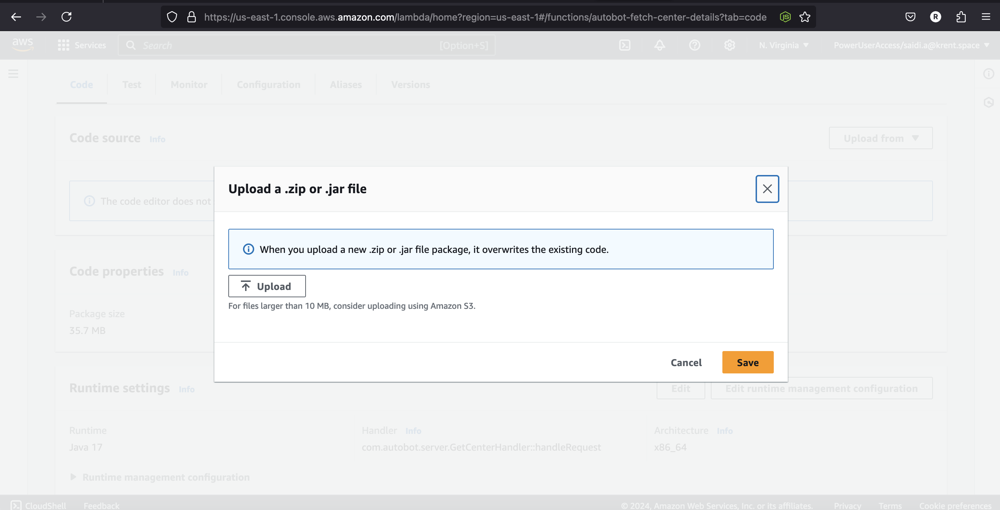
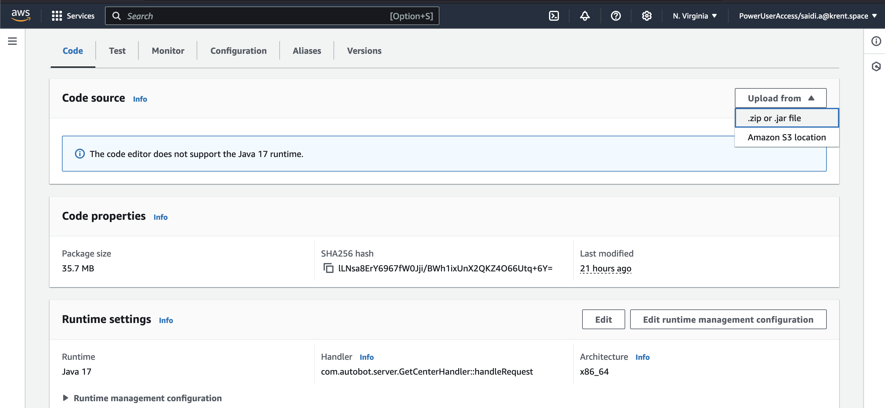

# Deploying to Lambda
# Deploying the Autobot Application to AWS Lambda

This guide outlines the steps to deploy your Autobot application to AWS Lambda. Follow the instructions below to ensure a successful deployment.

## Step-by-Step Deployment Process

### 1. Log in to the AWS Management Console

Start by logging in to your AWS Management Console.

### 2. Select the Lambda Service

Once logged in, navigate to the Lambda service. This will display a list of all your Lambda functions.

### 3. Choose the Desired Lambda Function

From the list of functions, select the specific Lambda function that you want to deploy your code to.

### 4. Upload Your Code

On the "Code" tab of the selected Lambda function, you can upload your new or updated code. This can be done by either directly editing the code in the inline editor or uploading a `.zip` file containing your packaged application.

### 5. Test the Code

After uploading your code, it is important to test the function to ensure that it behaves as expected. You can create a test event or use an existing one to trigger the Lambda function and check the output.

- Click on the "Test" button to run the code with the configured test event.
